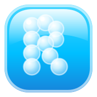

<div align="center">



# RicardoOS

**A personal site that boots like a tiny operating system — glassy, draggable, and built to be explored rather than scrolled.**


[](https://github.com/rikilamadrid/ricardoOS/actions/workflows/deploy.yml)


[Live site](https://ricardolamadrid.com) · [Changelog](CHANGELOG.md) · [Field Notes](https://ricardolamadrid.com/writing) · [Deploy notes](DEPLOY.md)

by Lamadrid Labs

</div>

RicardoOS is the portfolio of Ricardo Lamadrid, built as a desktop operating system in the browser.

Visitors don't read a page. They boot into a desktop, open apps in glassy draggable windows, rearrange icons, change the wallpaper, talk to a bubble mascot, and find a working terminal if they go looking.

It ships as a fully static export. No server, no database, no runtime rendering.

> The OS framing is the product. Every feature decision asks whether it makes RicardoOS feel more like a real, delightful operating system.

## What RicardoOS is

A single-page desktop shell with real windowing, plus crawlable pages behind it.

It provides:

- **a window manager** — open, focus, drag, resize, minimize, maximize, z-order, all in a Zustand store
- **apps** — one component per section, lazy-loaded, routed by `kind` from a data registry
- **a living wallpaper** — eight wallpapers across five scenes, with day/night theming and a colorblind-safe mode
- **trilingual content** — every user-facing string is `{ en, es, fr }`, resolved at render
- **real routes** — `/projects/[slug]` and `/writing/[slug]` are prerendered per locale for SEO and sharing

Sections are data, not markup. Adding an app means a registry entry in `src/data/os.ts` and a component in `src/components/apps/` — nothing else is hardcoded.

## What it is not

RicardoOS is **not** a template or a starter kit.

There is deliberately no:

- backend, database, or API route
- CMS or admin panel
- `tailwind.config.js` — Tailwind v4 is configured in CSS
- authentication
- client-side router for the desktop itself
- analytics or tracking

The desktop is the home base. Dedicated pages exist for the things worth linking to.

## The apps

| App | What it is |
| --- | --- |
| **About** | Short, human intro |
| **Projects** | Product-like cards that expand into `/projects/[slug]` |
| **Field Notes** | MDX writing, trilingual, at `/writing/[slug]` |
| **Experience** | Impact-focused chapters — no timeline, no skill bars |
| **Résumé** | Downloadable, in three languages |
| **Contact** | Elegant links plus a small form |
| **Meditations** | Dims the desktop into a calm space with a breathing orb |
| **Aero Amp** | A skinnable Winamp-style player with a 10-band EQ |
| **Terminal** | A real command parser, for people who try it |
| **Recycle Bin** | Contains the old portfolio. It judges you back |

Plus **Blip**, a desktop mascot that reacts to what you're doing and answers typed questions.

## Stack

| Layer | Choice |
| --- | --- |
| Framework | Next.js 16 (App Router), `output: "export"` |
| UI | React 19, TypeScript strict |
| Styling | Tailwind v4 (CSS config) + design tokens in `src/styles/tokens.css` |
| Components | Radix / shadcn |
| Motion | `motion` (Framer Motion) |
| State | Zustand + React context |
| Content | Typed TS in `src/data/*`, MDX in `src/content/posts/*` |
| Hosting | Hostinger, deployed by GitHub Actions on push to `main` |

## Getting started

```bash
npm install
npm run dev      # → http://localhost:3011
```

| Command | Does |
| --- | --- |
| `npm run dev` | Dev server on port 3011 |
| `npm run build` | Production static export — must pass before any commit |
| `npm run start` | Serve the production build |
| `npm run lint` | ESLint |
| `npm run version:minor` | Bump version + tag (also `:patch`, `:major`) |

## Project layout

```text
src/
├── app/                  # Routes, metadata, sitemap, OG images
├── components/
│   ├── os/               # The shell: Desktop, Window, Dock, MenuBar, Blip
│   ├── apps/             # One component per app
│   └── ui/               # shadcn primitives
├── content/
│   ├── posts/            # MDX field notes (trilingual)
│   └── wallpapers.ts
├── data/                 # Typed, localized content — the app registry lives here
├── lib/                  # Zustand stores, post loader, helpers
└── styles/tokens.css     # Every color, radius, shadow, blur
```

Deep context for contributors and AI agents lives in [`context/`](context/), with the working rules in [`CLAUDE.md`](CLAUDE.md).

## Conventions

A few rules this project actually enforces:

- **Data-driven.** Lists come from `src/data/*`. Never hardcode them in components.
- **Tokens, not magic numbers.** Colors, radii, shadows, and blur live in `tokens.css`.
- **Localize everything.** User-facing strings are `Localized<T>`, read with `t(value, locale)`.
- **Static-export discipline.** Metadata routes need `export const dynamic = "force-static"`.
- **`'use client'` only when needed.** The shell is client-side; content shouldn't be.
- **Honor `prefers-reduced-motion`.** Ambient loops stop; state changes stay instant.
- **Branch per feature, build before commit.** See [`context/ai-interaction.md`](context/ai-interaction.md).

Versioning follows [SemVer](https://semver.org) and [Keep a Changelog](https://keepachangelog.com).

## Contact

Ricardo Lamadrid — [ricardolamadrid.com](https://ricardolamadrid.com)

---

Source is public for reading and reference. The content, writing, and visual design are Ricardo's own.
